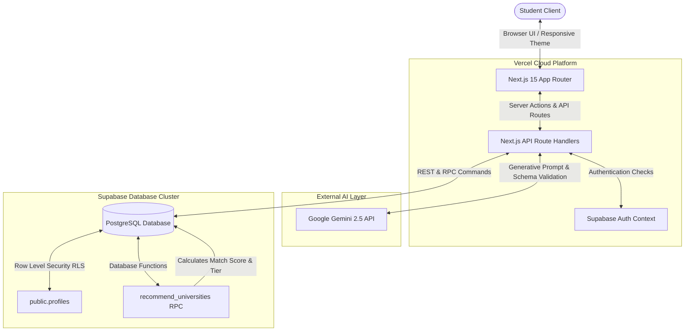

# 🎓 GradPath AI

> **The Open-Source Study Abroad OS for Indian Students.**  
> Streamline your international education journey: discover universities, explore matching scholarships, draft statements of purpose, simulate embassy interviews, and build chronological timelines — all in a unified, premium UI.

[](https://nextjs.org/)
[](https://react.dev/)
[](https://www.typescriptlang.org/)
[](https://supabase.com/)
[](https://deepmind.google/technologies/gemini/)
[](https://vercel.com/)
[](LICENSE)

---

## 🌐 Showcase & Links

*   **Live Application:** [https://gradpath-ai.vercel.app](https://gradpath-ai.vercel.app)
*   **GitHub Repository:** [https://github.com/aadivai/gradpath-ai](https://github.com/aadivai/gradpath-ai)

---

## ✨ Core Features

*   🎯 **AI University Recommendations:** Predicts admission match tiers (Safe, Moderate, Ambitious, Dream) based on your target intake, branch, CGPA, IELTS, GRE, and budget constraints.
*   💰 **Scholarship Discovery:** Tracks and predicts funding fit across government, merit-based, and university-specific international scholarship databases.
*   🛂 **Visa Intelligence:** Detailed country sheets, required documents checksheets, embassy interview credibility tips, and an AI Visa simulator prep tool.
*   ✍️ **SOP & LOR Studio:** Leverages Gemini 2.5 Flash to automatically draft version-controlled, customized Statements of Purpose and Letters of Recommendation matching your chosen country.
*   🔮 **AI Counsellor:** Performs comprehensive profile health audits, provides cost analysis, structures target timelines, and outlines strengths/gap diagnostics.
*   📅 **Timeline Planner:** Chronological, month-by-month Kanban roadmap mapping your path from language preparation to pre-departure flights.
*   🔐 **Secure Authentication:** Managed via Supabase Auth (Sign-in, Sign-up, Password Recovery) with Row-Level Security (RLS) policies protecting all profile data.

---

## 📸 Screenshots

| Landing Page | Dashboard Overview |
| :--- | :--- |
|  |  |

| University Matcher | Scholarship Explorer |
| :--- | :--- |
|  |  |

| Profile Setup | SOP Assistant |
| :--- | :--- |
|  |  |

---

## 🏛 System Architecture



---

## 📂 Folder Directory

```
gradpath-ai/
├── .github/
│   └── workflows/
│       └── ci.yml             # GitHub Actions continuous integration pipeline
├── docs/                      # Core system & architectural documentation
│   ├── architecture.md        # Technical design & layout strategy
│   ├── database.md            # Entity relationships, tables, & policies
│   ├── api.md                 # Complete API endpoint dictionary
│   ├── deployment.md          # Cloud build & setup steps
│   └── security.md            # Row Level Security (RLS) & auth verification
├── public/                    # Static assets & public images
│   ├── screenshots/           # Application screenshots for GitHub
│   ├── robots.txt             # Search crawler controls
│   └── sitemap.xml            # Search indexing sitemap
├── src/
│   ├── app/                   # Next.js App Router (pages, APIs, layouts)
│   │   ├── (auth)/            # Sign-in, Sign-up, reset password modules
│   │   ├── (dashboard)/       # Main student dashboard & tools
│   │   ├── api/               # API route handlers
│   │   └── layout.tsx         # Global html wrapper
│   ├── components/            # Reusable UI widgets & providers
│   │   ├── ui/                # UI design component blocks
│   │   └── providers/         # Global state/auth providers
│   ├── lib/                   # Integrations & client wrappers
│   │   ├── ai/                # Gemini client utilities
│   │   ├── serverSupabase.ts  # Server-side Supabase client
│   │   └── recommender.ts     # Recommendation RPC wrappers
│   ├── types/                 # Unified TypeScript interfaces
│   └── utils/                 # Utility parsers & helper scripts
├── tests/                     # Playwright E2E browser tests
├── package.json               # Package dependencies & script commands
├── tailwind.config.js         # Styling configurations
└── tsconfig.json              # TypeScript compilation rules
```

---

## 💾 Database Schema

The database relies on a PostgreSQL schema hosted on Supabase:

*   **`profiles`**: Stores student academic history, target intakes, work experience metrics, and preferred countries. Secured via RLS (only user can read/write their own row).
*   **`universities`**: Static reference catalog of 2000+ worldwide universities, qs rankings, tuition costs, and eligibility scores.
*   **`scholarships`**: Metadata for merit, need-based, and government-specific student funding opportunities.
*   **`saved_universities`**: Junction table mapping student profiles to their saved universities (including tracking status and notes).
*   **`timeline_tasks`**: Tasks and checklist items representing application milestones.
*   **`visa_requirements`**: Structured parameters for study visas (financial proof, processing times, required documents).

---

## 🔑 Environment Variables

To configure GradPath AI locally, create a `.env.local` file in the root directory:

```env
# Supabase Configuration
NEXT_PUBLIC_SUPABASE_URL=your-supabase-project-url
NEXT_PUBLIC_SUPABASE_ANON_KEY=your-supabase-anon-key

# Google Gemini AI API Configuration
GEMINI_API_KEY=your-google-gemini-api-key
```

---

## 🛠 Local Setup

1.  **Clone the Repository:**
    ```bash
    git clone https://github.com/aadivai/gradpath-ai.git
    cd gradpath-ai
    ```

2.  **Install Project Dependencies:**
    ```bash
    npm install
    ```

3.  **Run the Development Server:**
    ```bash
    npm run dev
    ```

4.  **Access the Application:**
    Open [http://localhost:3000](http://localhost:3000) on your web browser.

---

## 🚀 Cloud Deployment

### 1. Database (Supabase)
*   Deploy a new PostgreSQL project on [Supabase](https://supabase.com/).
*   Apply the schemas for `profiles`, `universities`, `scholarships`, `saved_universities`, `timeline_tasks`, and `visa_requirements`.
*   Establish RLS policies ensuring all student data is partition-bound (`auth.uid() = clerk_user_id` or similar profile ID mapping).

### 2. Frontend & API (Vercel)
*   Connect your GitHub repository to [Vercel](https://vercel.com/).
*   Import the project and configure the environment variables defined in `.env.local`.
*   Deploy! Vercel handles all SSR and serverless function routing automatically.

---

## 🗺 Platform Roadmap

### Current Version (v1.0 Production Release)
*   [x] Database-level matching algorithm via PostgreSQL RPCs.
*   [x] Gemini AI-driven explanation generators for university matches.
*   [x] Dynamic checklists, ATS audit scores, and PDF exports for Statements of Purpose.
*   [x] Interactive Visa preparation simulators and credibility checklists.
*   [x] Premium fluid layout designs with responsive mobile adaptations.

### Future Targets
*   [ ] Real-time document translation (transcripts to standard english).
*   [ ] Peer mentoring networking rooms with active university alumni.
*   [ ] Automated visa slot alerts and notification tracking.
*   [ ] Direct university application processing portals.

---

## 🤝 Contributing

Contributions are welcome! Please follow these guidelines:
1.  Fork the repository.
2.  Create a feature branch (`git checkout -b feature/AmazingFeature`).
3.  Commit your changes (`git commit -m 'Add some AmazingFeature'`).
4.  Push to the branch (`git push origin feature/AmazingFeature`).
5.  Open a Pull Request.

---

## 📄 License

Distributed under the MIT License. See `LICENSE` for details.
