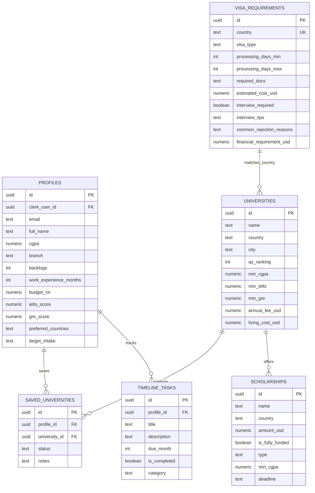

# GradPath AI — Database Schema & Policies

The database is built on a PostgreSQL cluster hosted on Supabase. It uses Row-Level Security (RLS) to ensure tenant isolation, custom indexes for optimization, and views for statistics aggregation.

---

## Entity Relationship Diagram

---

## Tables Dictionary

### 1. `profiles`
Holds student academic metrics and preferences.
*   `id` (uuid, Primary Key)
*   `clerk_user_id` (uuid, Unique Reference to Supabase Auth User ID)
*   `full_name` (text, contains string or serialized metadata suffix)
*   `email` (text)
*   `cgpa` (numeric, Constraint: `cgpa >= 0.0 AND cgpa <= 10.0`)
*   `branch` (text)
*   `budget_inr` (numeric, Constraint: `budget_inr >= 0`)
*   `ielts_score` (numeric, Constraint: `ielts_score >= 0.0 AND ielts_score <= 9.0`)
*   `gre_score` (numeric)
*   `preferred_countries` (text[])
*   `target_intake` (text)

### 2. `universities`
Directory of international universities.
*   `id` (uuid, Primary Key)
*   `name` (text, Unique)
*   `country` (text, Index: `idx_university_country`)
*   `city` (text)
*   `qs_ranking` (integer, Index: `idx_university_qs`)
*   `min_cgpa` (numeric)
*   `min_ielts` (numeric)
*   `min_gre` (numeric)
*   `annual_fee_usd` (numeric)
*   `living_cost_usd` (numeric)

### 3. `scholarships`
Financial funding options database.
*   `id` (uuid, Primary Key)
*   `name` (text)
*   `country` (text, Index: `idx_scholarship_country`)
*   `amount_usd` (numeric)
*   `is_fully_funded` (boolean)
*   `type` (text)
*   `min_cgpa` (numeric)
*   `deadline` (text, Index: `idx_scholarship_deadline`)

### 4. `saved_universities`
Junction table tracking saved options.
*   `id` (uuid, Primary key)
*   `profile_id` (uuid, Foreign Key references `profiles(id)`)
*   `university_id` (uuid, Foreign Key references `universities(id)`)
*   `notes` (text)
*   `status` (text)

---

## Custom Database Indexes & Constraints

To ensure sub-100ms querying speeds, the database enforces these indexes:
*   `idx_university_country` on `universities (country)`
*   `idx_university_qs` on `universities (qs_ranking)`
*   `idx_scholarship_country` on `scholarships (country)`
*   `idx_scholarship_deadline` on `scholarships (deadline)`
*   `idx_saved_profile` on `saved_universities (profile_id)`
*   `idx_timeline_profile` on `timeline_tasks (profile_id)`

---

## Row-Level Security (RLS) Policies

All tables exposed to public endpoints enforce RLS. Examples:

1.  **`profiles`**:
    *   `Enable read for users matching uid`: `auth.uid() = clerk_user_id`
    *   `Enable update for users matching uid`: `auth.uid() = clerk_user_id`

2.  **`saved_universities`**:
    *   `Enable read for owners`: `profile_id IN (SELECT id FROM profiles WHERE clerk_user_id = auth.uid())`
    *   `Enable insert/update/delete for owners`: Same subquery constraint.

3.  **`timeline_tasks`**:
    *   `Enable all operations for owners`: `profile_id IN (SELECT id FROM profiles WHERE clerk_user_id = auth.uid())`
