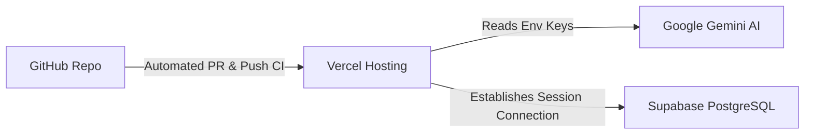

# GradPath AI — Cloud Deployment Manual

GradPath AI is structured for zero-overhead serverless deployments. The frontend and API endpoints are hosted on Vercel, and the relational data, authentication, and security logic are managed on Supabase.

---

## Deployment Blueprint

---

## 1. Supabase Project Setup

1.  **Create Project**:
    Create a new project in your [Supabase Dashboard](https://supabase.com/). Select the region closest to your primary user base (e.g., `ap-south-1` for Indian students).

2.  **Initialize Tables**:
    Paste the SQL schemas into the Supabase SQL Editor to initialize the tables (`profiles`, `universities`, `scholarships`, `saved_universities`, `timeline_tasks`, `visa_requirements`).

3.  **Seed Reference Data**:
    Populate the static `universities` and `scholarships` tables. Ensure the seed data for countries is loaded.

4.  **Enforce Row-Level Security**:
    Enable RLS on all tables and create access policies targeting the authenticated user ID (`auth.uid()`).

---

## 2. Vercel Hosting Setup

1.  **Import Project**:
    Link your GitHub repository in your Vercel Dashboard. Vercel automatically identifies the Next.js framework configuration.

2.  **Set Environment Variables**:
    Under Project Settings -> Environment Variables, input the keys:
    *   `NEXT_PUBLIC_SUPABASE_URL`: Your Supabase API connection endpoint URL.
    *   `NEXT_PUBLIC_SUPABASE_ANON_KEY`: The public anonymous key for Supabase client queries.
    *   `GEMINI_API_KEY`: The API key generated from Google AI Studio.

3.  **Deploy Project**:
    Click deploy. Vercel compiles static assets, sets up serverless functions for Next.js App Router route handlers, and hosts the app on a global CDN.

---

## 3. Production Optimizations

*   **Turbopack Builds**: Local builds use `--turbo` compiler flags. Production pipelines compile components with optimized bundle sizing.
*   **Edge Middleware**: Route validation and role checks are processed at the network edge via Next.js Middleware before hitting downstream compute layers.
*   **Static Resource Caching**: Client bundles, styles, and font layouts (`next/font`) are distributed via the Vercel edge network for instant loading.
