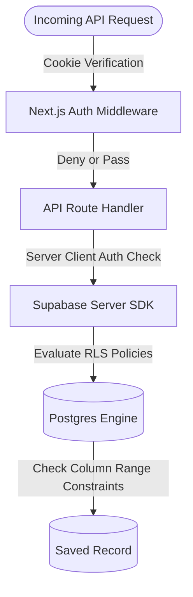

# GradPath AI — Security & Authentication Design

GradPath AI employs a defense-in-depth security model to safeguard personal student records, academic data, and AI interactions from unauthorized access or malicious input.

---

## Security Layer Diagram



---

## 1. Authentication Layer

Authentication is powered by **Supabase Auth** using cookies to handle session persistence securely:
*   **Edge Verification**: Session checks are validated directly at the Edge using Next.js Middleware. If a session is missing or expired, the user is redirected to the `/login` page before any API route or dashboard page is loaded.
*   **Mock Clerk Interface Compatibility**: A custom client wrapper (`SupabaseAuthProvider.tsx`) exposes a Clerk-like `useUser()` interface so that components have access to:
    *   `user.id` (mapped to user uuid)
    *   `user.email`
    *   `publicMetadata.role` (e.g. `student`, `admin`)

---

## 2. Row-Level Security (RLS)

All user tables in the database have RLS enabled. Supabase enforces these policies directly at the SQL engine level:
*   **`profiles`**: A user can access and modify their own profile, with administrative overrides for auditing and config. The security constraint is defined as:
    ```sql
    clerk_user_id = auth.uid()::text
    ```
*   **Junction Tables (`saved_universities`, `timeline_tasks`)**: Access is validated by checking if the referenced profile belongs to the calling user:
    ```sql
    profile_id IN (
        SELECT id FROM public.profiles 
        WHERE clerk_user_id = auth.uid()
    )
    ```

---

## 3. Database Check Constraints

To prevent data pollution and ensure strict data validation, the database uses PostgreSQL check constraints:
*   **CGPA Range Check**: Ensures GPA values are realistic (between 0.0 and 10.0):
    ```sql
    CONSTRAINT chk_profile_cgpa CHECK (cgpa IS NULL OR (cgpa >= 0.0 AND cgpa <= 10.0))
    ```
*   **IELTS Range Check**: Validates score boundaries (between 0.0 and 9.0):
    ```sql
    CONSTRAINT chk_profile_ielts CHECK (ielts_score IS NULL OR (ielts_score >= 0.0 AND ielts_score <= 9.0))
    ```
*   **Budget Validation**: Prevents negative values:
    ```sql
    CONSTRAINT chk_profile_budget CHECK (budget_inr IS NULL OR budget_inr >= 0)
    ```

---

## 4. API Key Protection & Generative AI Safety

*   **Server-Only Execution**: The `GEMINI_API_KEY` is loaded as a server-side environment variable. It is **never** sent or exposed to the client browser.
*   **Output Sanitization**: The server queries Gemini using structured Zod models (`explainRecommendations.ts`) to validate JSON shapes. This protects the frontend from parsing malicious or unstructured text outputs.
